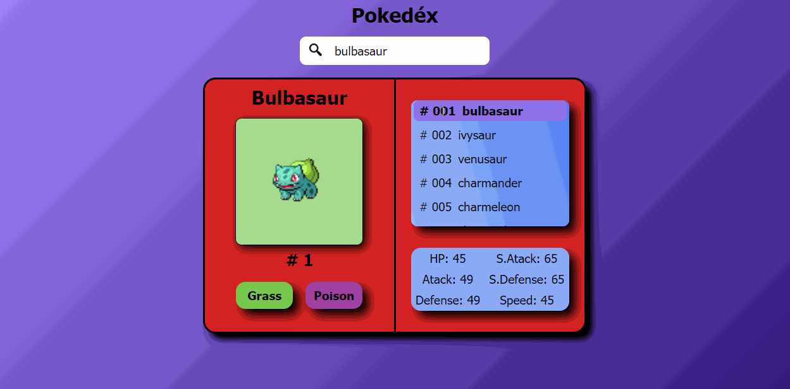

# Pokedex

 
Project that fetches data about Pokemon from PokeAPI

 
<h2> Project created to practice API requests, manipulation and display this data</h2>

In this project I challenged myself to create api requests and dynamically change the HTML and CSS using Javascript.

<h2> Preview: </h2>

